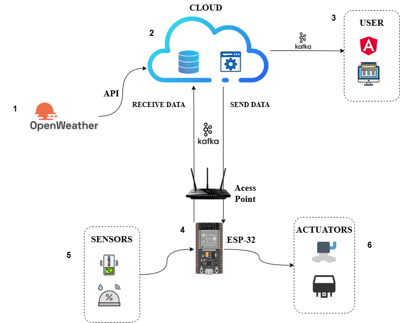
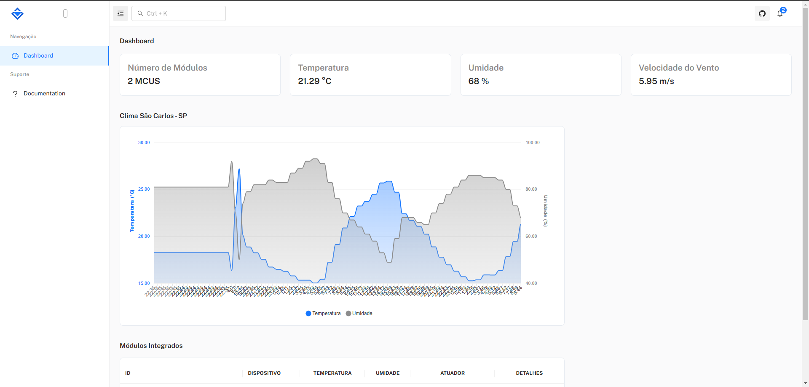

# 🌱 Cloud USP - Smart Irrigation System (IoT + Kafka + ESP32 + React)

This is the repository for the **Cloud USP - Smart Irrigation System**, a **precision agriculture** project integrating **IoT (ESP32 + DHT11 sensors)**, **Cloud Computing**, **Kafka**, **MQTT**, **MongoDB**, **Python**, **React**, and **Docker**.

---

## Overview

The system enables:

- Real-time monitoring of **environmental variables** (temperature, humidity, wind speed, etc).
- Integration of **OpenWeather API** forecasts with local sensor data.
- **Remote control** of irrigation devices.
- Visualization of data and charts in a **responsive web interface**.

---

## System Architecture



### Main Components:

- **ESP32:** Sensor data acquisition and actuator control.
- **MQTT (Mosquitto):** Communication between devices and backend.
- **Kafka:** Internal asynchronous messaging pipeline.
- **MongoDB:** Data persistence.
- **Backend (Python + Docker):** Message processing and database integration.
- **Frontend (React + Mantis Template):** Data visualization and device control UI.
- **OpenWeather API:** External weather data source.

---

## Example Screenshots

### Weather Data Visualization:

*Example:*  


---

### Per-Device Monitoring:

*Example:*  


---

## Setup and Run Instructions

### 1. Set Up Python Virtual Environment

Navigate to the **consumer** directory:

```bash
cd consumer
python -m venv venv
```

Activate the virtual environment:

- **Windows:**
```bash
.env\Scriptsctivate
```
- **Linux/Mac:**
```bash
source venv/bin/activate
```

Install dependencies:

```bash
pip install -r requirements.txt
```

---

### 2. Start Docker Containers (Kafka, MongoDB, etc.)

In the following directories:

- `..\cloud\kafka\`
- `..\cloud\producer\`

Run:

```bash
docker-compose up
```

---

### 3. Build and Run the Consumer (OpenWeather Consumer)

In the `consumer` directory:

```bash
docker build -t consumer_open_weather .
```

Run the container:

```bash
docker run --name consumer_open_weather --network net-esp -p 9005:9005 -d consumer_open_weather
```

---

### 4. Run MongoDB

```bash
docker run --name mongo-esp --network net-esp -p 27017:27017 -d mongodb/mongodb-community-server:latest
```

**Quick Explanation:**

- `--name mongo-esp`: Container name.
- `--network net-esp`: Internal Docker network.
- `-p 27017:27017`: Exposes MongoDB port.
- `mongodb/mongodb-community-server:latest`: MongoDB image.

---

### 5. Run the Consumer Manually (Optional)

```bash
cd consumer
python main.py
```

---

### 6. Deploy Backend / Frontend

- **Backend:** Run backend services (Node.js or Python) with access to Kafka and MongoDB.
- **Frontend:** React (Mantis Template) → Access via browser:

If running locally:

```
http://localhost:5082/
```

If deployed on USP server:

```
http://andromeda.lasdpc.icmc.usp.br:5082/
```

---

## ✅ Tested Functionalities

- Real-time data collection from ESP32 + MQTT.
- Kafka data pipeline.
- Data persistence in MongoDB.
- OpenWeather API integration.
- Real-time chart visualization via Frontend.
- Remote device control from web interface.

---

## 📂 Repository Structure

```plaintext
gcloudpos03/
├── Backend/
├── Frontend/
├── Firmware/
├── Docker/
├── Kafka/
├── MongoDB/
├── consumer/
├── docs/
│   └── img/
├── README.md
└── ...
```

---

## 📈 Results

- Real-time visualization of environmental variables.
- Remote irrigation control.
- Water waste reduction.
- Multi-ESP32 support.

---

## 🧪 Requirements

- **Docker + Docker Compose**
- **Python 3.x**
- **Node.js (for backend/frontend if applicable)**
- **ESP32 Board**
- **Running MQTT Broker**
- **Running Kafka + Zookeeper**
- **Running MongoDB**

---

## 📚 Technical References

- OpenWeather API
- Apache Kafka
- Mosquitto MQTT
- ESP32 Docs
- Mantis React Template (https://codedthemes.gitbook.io/mantis)

---

## ✅ Project Link

https://github.com/ICMC-SSC5973-2024/gcloudpos03

---

**Contributions are welcome!**  
Fork the project, open a PR, or report issues.
